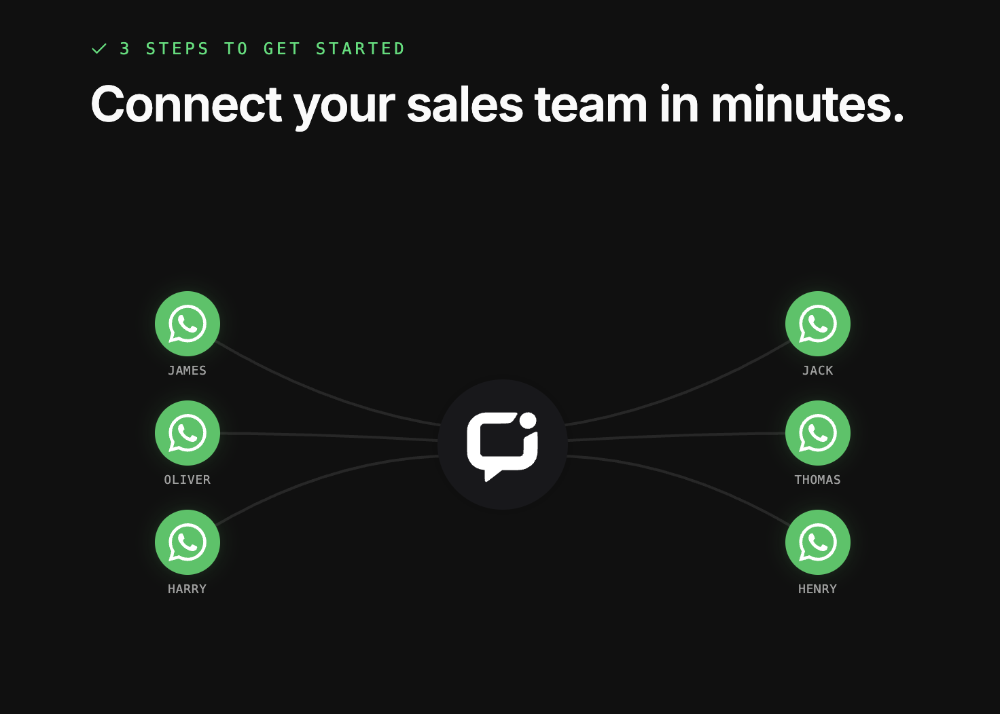
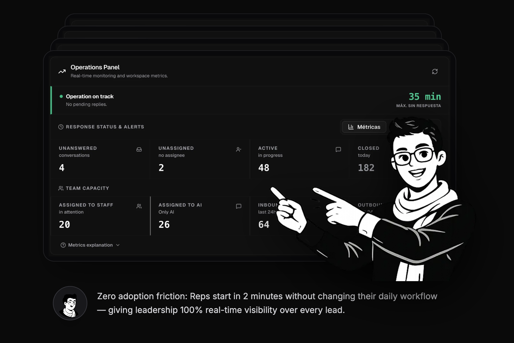
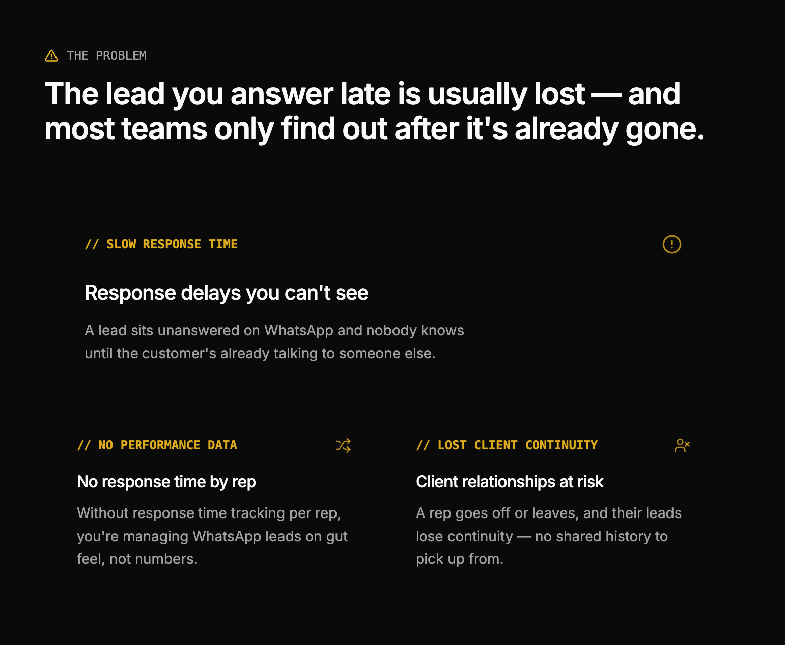

# Levvo — Stop Losing WhatsApp Leads & Manage Your Sales Team with Ease

> **The simple oversight workspace for business owners and sales leaders who issue WhatsApp lines to their team.**  
> *No unmonitored rep phones. No forgotten leads. 100% of your client history stays in your hands.*

**Complete visibility and peace of mind for your sales floor.**  
Built by Frank A. for sales leaders and operations managers. Designed for business owners who issue work WhatsApp lines to their team and need real-time oversight, faster team response times, and total control over their client database.

👉 🌐 **Open Web App:** [levvoapp.com](https://levvoapp.com)  
👉 💻 **Download Free Mac App:** [LevvoApp.dmg](./beta-mac-os/LevvoApp.dmg) (Mac Desktop App)

---

## 🚀 What You Can Do Every Day with Levvo

Instead of managing chaos or guessing what reps are doing, Levvo gives you a clear workspace where every lead has an owner, a clear history, and a immediate next step:

*   **See All Team Lines in One Place:** View active conversations, check response times, and review quotes across all your sales reps' WhatsApp lines from a single dashboard.
*   **Never Let a Lead Wait Cold:** Incoming customer messages are automatically assigned to available sales reps so every prospect gets an answer in seconds.
*   **Your Client Roster Stays Yours Forever:** All customer chats, notes, and negotiation details belong to your company. If a rep leaves or changes handsets, your client relationships stay safely with your business.
*   **We Help You Set Up & Onboard Your Team:** You don't need tech skills. We walk you through connecting your team's WhatsApp lines in 5 minutes and give you direct human support whenever you need help.
*   **Instant AI Assistant to Help Close Deals:** Click anytime to check if a lead is ready to buy, spot deal risks, and get suggested next steps to keep negotiations moving.
*   **Track Team Response Speed Without Manual CRM Forms:** Get clear summaries showing how fast reps reply, who is following up, and which deals need attention—with zero manual data entry required.
*   **Use Anywhere (Mac App or Web Browser):** Access your sales cockpit from any browser at [levvoapp.com](https://levvoapp.com) or download our free desktop Mac App ([LevvoApp.dmg](./beta-mac-os/LevvoApp.dmg)).

---

## 🔥 Daily Problems We Solve for Sales Leaders

If you manage 4 to 20+ sales reps on WhatsApp (in real estate, car dealerships, education, or B2B services), you know these daily headaches:

*   **Unmonitored Separate Rep Handsets:** Managers can't see what reps are saying, quotes being sent, or delays without asking to look at physical phones.
*   **Slow Rep Responses:** High-intent leads wait hours because nobody assigned the chat or noticed the incoming message.
*   **Stolen Client Contacts When Reps Leave:** When a salesperson resigns, they take client relationships and conversation history with them on their personal phone.
*   **Wasted Marketing Budget:** Money spent generating WhatsApp leads gets wasted because reps take too long to follow up and prospects move on to competitors.

**Levvo fixes these blind spots so your sales floor stays fast, organized, and accountable.**

---

## 🛠️ Key Capabilities Made Simple

### 1. Team WhatsApp Line Control
*   **5-Minute Setup:** Connect your company WhatsApp lines instantly by scanning a QR code, or link Meta Cloud API, Telegram, and Live Chat.
*   **Automatic Lead Distribution:** Direct incoming leads to the right specialist or share them fairly among online reps so every lead is claimed fast.
*   **Organized Chat Statuses:** Keep your inbox clean with `open` (active chats), `closed` (done, reopens if client texts back), and `blocked` (spam filter).

### 2. Smart Sales Assistance & Simple Reporting
*   **AI Deal Assistant:** Analyze any chat thread with one click to see buyer intent (`Ready to Buy`, `Considering`, `Blocked`) and get suggested next steps.
*   **Team Performance Summaries:** Instantly see rep response speeds, follow-up habits, and common deal blockers—no manual updates needed.
*   **Automatic Greeting for Unassigned Leads:** Automatically greet incoming chats after hours or during busy spikes so leads know someone is on it.

---

## 🚫 What Levvo IS NOT

To keep things simple and easy for your team, Levvo is explicitly:
*   ❌ **NOT a complicated CRM** with endless forms reps hate filling out.
*   ❌ **NOT a confusing chatbot builder** requiring complex flowcharts.
*   ❌ **NOT a mass spam campaign tool**.

*Levvo starts the moment a customer writes and helps your team deliver a fast, successful outcome.*

---

## 💳 Simple & Transparent Prepaid Pricing

**No expensive monthly contracts, no per-user tier lock-ins, and zero per-message Meta fees on direct QR connections.**  
You operate on simple prepaid workspace credits with welcome credits included so you can start supervising your sales floor today with our support team helping you every step.

---

## 📚 Helpful Links

*   [Pricing Overview](./PRICES.md)
*   [Frequently Asked Questions](./FAQ.md)

---

© Levvo 2026 · Built by Frank A. for sales & operations teams. · [levvoapp.com](https://levvoapp.com) · Faster response. Better customer outcomes.
